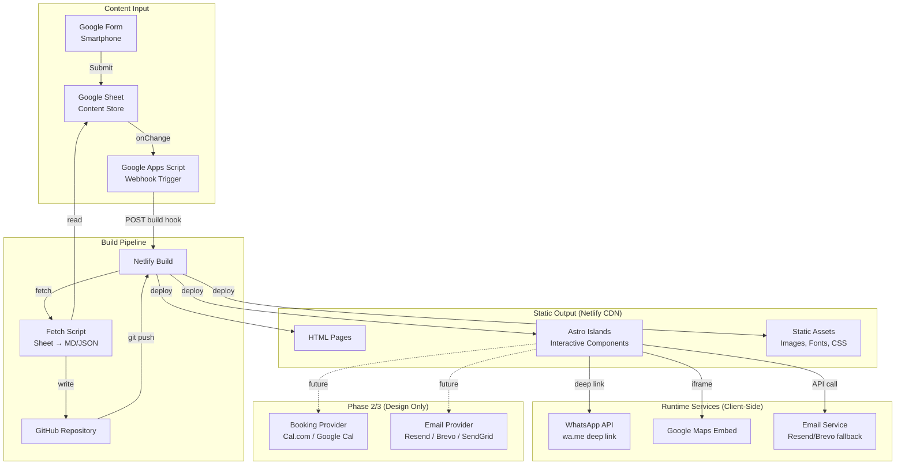
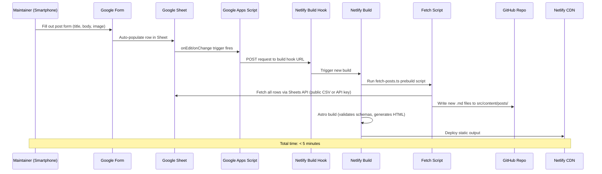
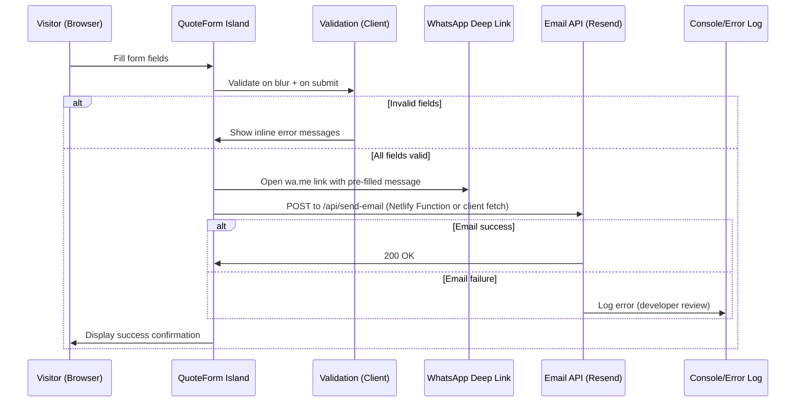
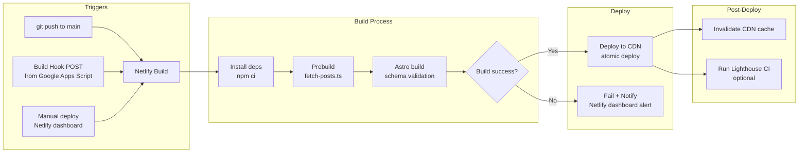

# Design Document — ASM AUTO Repair Website

## Overview

This document defines the technical design for the ASM AUTO Repair marketing website — a static-first Astro 4.x site deployed to Netlify free tier. The architecture prioritizes zero-runtime cost, sub-2.5s LCP on mobile, portable content (Markdown/JSON in Git), and a smartphone-only maintainer workflow via Google Forms.

The design covers Phase 1 (full build), Phase 2 (appointment booking — interface design only), and Phase 3 (email notifications — interface design only). Deferred features use environment-variable feature flags and provider adapter abstractions to avoid lock-in.

**Key Design Decisions:**
- **Astro static output** — no SSR, no server runtime, pure HTML/CSS/JS output
- **Astro islands** — interactive components hydrated selectively via `client:load` / `client:visible`
- **Content collections with Zod** — build-time schema validation catches errors before deploy
- **Google Form → Sheet → webhook → rebuild** — zero-friction content pipeline for non-technical maintainer
- **Provider adapters** — TypeScript interfaces for future integrations, implementations swappable without app logic changes
- **CSS custom properties** — design tokens defined once, consumed everywhere

## Architecture

### System Diagram



### Architecture Layers

| Layer | Technology | Responsibility |
|-------|-----------|----------------|
| Content Authoring | Google Forms + Sheets | Non-technical content input |
| Content Storage | Markdown/JSON in Git | Portable, version-controlled content |
| Build System | Astro 4.x + Netlify | Static site generation, schema validation |
| Delivery | Netlify CDN | Global edge delivery, HTTPS, caching |
| Interactivity | Astro Islands (Preact) | Quote form, maps, open-now, mobile nav, lightbox |
| Styling | CSS Custom Properties + Scoped CSS | Design system tokens, component styles |
| Future Integrations | TypeScript Adapters | Booking, email — behind feature flags |

### Technology Choices

- **Framework:** Astro 4.x — static output, island architecture, content collections with Zod
- **Island Runtime:** Preact — lightweight (3KB), familiar JSX, sufficient for form/map/nav islands
- **Styling:** Scoped `<style>` in Astro components + global CSS custom properties (no Tailwind — keeps bundle minimal and avoids framework dependency)
- **Content:** Astro content collections — Markdown for posts, JSON for services/gallery metadata
- **Hosting:** Netlify free tier (100GB bandwidth, 300 build min/month)
- **Forms:** Client-side Preact island → WhatsApp deep link + email API (Resend free tier: 100 emails/day)
- **Maps:** Google Maps Embed API (free, no API key for basic embed)
- **Fonts:** Inter (Google Fonts, self-hosted subset for performance)

## Components and Interfaces

### Project Structure

```
src/
├── components/
│   ├── layout/
│   │   ├── BaseLayout.astro        # HTML shell, meta, fonts, global CSS
│   │   ├── Header.astro            # Desktop nav + sticky mobile header
│   │   ├── Footer.astro            # Hours, address, social links, nav
│   │   ├── MobileNav.tsx           # Island: hamburger menu overlay (client:load)
│   │   └── SkipToContent.astro     # Accessibility skip link
│   ├── shared/
│   │   ├── Card.astro              # Reusable card container (24px radius, border)
│   │   ├── CTAButton.astro         # Primary/secondary CTA styling
│   │   ├── SectionHeading.astro    # h2 with consistent spacing
│   │   ├── SEOHead.astro           # Meta title, description, canonical, JSON-LD
│   │   └── FeatureFlag.astro       # Conditional render based on env var
│   ├── home/
│   │   ├── Hero.astro              # Full-viewport hero with tagline + CTA
│   │   ├── ServicesOverview.astro   # 4-category grid preview
│   │   ├── Testimonials.astro      # 3+ review highlights
│   │   ├── Benefits.astro          # Icon + label benefit items
│   │   ├── PricingPreview.astro    # 3+ starting prices
│   │   ├── WhyChooseUs.astro       # 4 differentiators
│   │   └── ReviewBadge.astro       # Google rating badge (4.4/5)
│   ├── services/
│   │   ├── ServiceCard.astro       # Service listing card
│   │   └── ServiceDetail.astro     # Full service page content
│   ├── gallery/
│   │   ├── GalleryGrid.astro       # Responsive image grid
│   │   └── Lightbox.tsx            # Island: fullscreen image viewer (client:visible)
│   ├── contact/
│   │   ├── BusinessHours.astro     # Weekly hours display
│   │   ├── OpenNowIndicator.tsx    # Island: live open/closed status (client:load)
│   │   ├── GoogleMap.tsx           # Island: maps embed with fallback (client:visible)
│   │   └── ContactInfo.astro       # Address, phone, email, WhatsApp
│   ├── posts/
│   │   ├── PostCard.astro          # Post listing card (title, date, excerpt)
│   │   └── Pagination.astro        # 10-per-page navigation
│   ├── quote/
│   │   └── QuoteForm.tsx           # Island: full quote form (client:load)
│   ├── cta/
│   │   └── FloatingCTA.astro       # Fixed mobile call + WhatsApp buttons
│   └── faq/
│       └── FAQAccordion.astro      # Expandable Q&A section
├── content/
│   ├── services/                   # Markdown files per service
│   ├── posts/                      # Markdown files per post
│   └── config.ts                   # Zod schemas for collections
├── data/
│   ├── gallery.json                # Gallery image metadata
│   ├── testimonials.json           # Customer reviews
│   ├── faq.json                    # FAQ content
│   ├── pricing.json                # Service starting prices
│   ├── benefits.json               # Benefit items
│   └── business-info.json          # Hours, address, phone, social links
├── pages/
│   ├── index.astro                 # Homepage
│   ├── services/
│   │   ├── index.astro             # Services listing
│   │   └── [slug].astro            # Dynamic service detail pages
│   ├── about.astro                 # About page
│   ├── gallery.astro               # Gallery page
│   ├── contact.astro               # Contact/Location page
│   ├── posts/
│   │   ├── index.astro             # Posts listing (paginated)
│   │   └── [slug].astro            # Individual post pages
│   └── quote.astro                 # Quote request page
├── styles/
│   ├── global.css                  # Reset, tokens, typography, utilities
│   └── fonts.css                   # @font-face declarations
├── lib/
│   ├── adapters/
│   │   ├── booking.ts              # Phase 2 adapter interface
│   │   └── email.ts                # Phase 3 adapter interface
│   ├── feature-flags.ts            # Feature flag utility
│   ├── validation.ts               # Form validation logic
│   └── format.ts                   # Date, time, phone formatting
├── scripts/
│   └── fetch-posts.ts              # Build script: Sheet → Markdown
└── public/
    ├── fonts/                      # Self-hosted Inter subset
    ├── images/                     # Static images, gallery placeholders
    ├── icons/                      # SVG icons (phone, WhatsApp, etc.)
    └── favicon.svg
```

### Island Components (Interactive — Hydrated on Client)

| Component | Directive | Purpose |
|-----------|-----------|---------|
| `QuoteForm.tsx` | `client:load` | Form with validation, submission to WhatsApp + email |
| `OpenNowIndicator.tsx` | `client:load` | Real-time open/closed status using client clock |
| `MobileNav.tsx` | `client:load` | Hamburger menu toggle and overlay |
| `GoogleMap.tsx` | `client:visible` | Lazy-loaded Google Maps iframe with fallback |
| `Lightbox.tsx` | `client:visible` | Gallery image fullscreen viewer |

### Static Components (Server-Rendered — Zero JS)

All other `.astro` components render at build time with no client JavaScript. This includes all layout, cards, CTAs, content sections, SEO metadata, and pagination.

## Data Models

### Content Collection Schemas (`src/content/config.ts`)

```typescript
import { defineCollection, z } from 'astro:content';

// Services Collection
const servicesCollection = defineCollection({
  type: 'content', // Markdown with frontmatter
  schema: z.object({
    title: z.string().min(1).max(100),
    slug: z.string().regex(/^[a-z0-9-]+$/),
    summary: z.string().min(1).max(150),
    description: z.string().min(20),
    benefits: z.array(z.string().min(1)).min(3).max(6),
    icon: z.string().optional(), // SVG icon name
    order: z.number().int().positive(),
    startingPrice: z.number().positive().optional(),
  }),
});

// Posts Collection
const postsCollection = defineCollection({
  type: 'content', // Markdown with frontmatter
  schema: z.object({
    title: z.string().min(1).max(120),
    slug: z.string().regex(/^[a-z0-9-]+$/),
    publishedDate: z.coerce.date(),
    excerpt: z.string().max(160).optional(),
    featuredImage: z.string().url().or(z.string().startsWith('/')),
    author: z.string().default('ASM AUTO Repair'),
    draft: z.boolean().default(false),
  }),
});

export const collections = {
  services: servicesCollection,
  posts: postsCollection,
};
```

### Static Data Schemas (`src/data/`)

```typescript
// business-info.json schema
interface BusinessInfo {
  name: string;                    // "ASM AUTO Repair"
  address: {
    street: string;                // "296 Brock Ave"
    city: string;                  // "Toronto"
    province: string;              // "ON"
    postal: string;                // "M6K 2M4"
    full: string;                  // "296 Brock Ave, Toronto, ON M6K 2M4"
  };
  phone: string;                   // "+14165168181"
  phoneDisplay: string;            // "(416) 516-8181"
  email: string;
  whatsappUrl: string;             // "https://wa.me/14165168181"
  coordinates: { lat: number; lng: number };
  hours: DayHours[];
  socialLinks: { platform: string; url: string; label: string }[];
  googleReview: { rating: number; count: number } | null;
}

interface DayHours {
  day: string;                     // "Monday"
  open: string | null;             // "10:00" or null (closed)
  close: string | null;            // "19:00" or null
  display: string;                 // "10 a.m. – 7 p.m." or "Closed"
}
```

```typescript
// gallery.json schema
interface GalleryImage {
  src: string;                     // "/images/gallery/img-01.webp"
  alt: string;                     // Descriptive alt text (5-125 chars)
  width: number;
  height: number;
  category?: string;               // "workshop" | "vehicles" | "team"
}
```

```typescript
// testimonials.json schema
interface Testimonial {
  name: string;
  text: string;                    // Review excerpt
  rating: number;                  // 1-5
}
```

```typescript
// faq.json schema
interface FAQItem {
  question: string;
  answer: string;
}
```

### Quote Form Data Model

```typescript
interface QuoteRequest {
  // Required fields
  name: string;                    // max 100 chars
  mobile: string;                  // 10-digit format
  email: string;                   // valid email
  workType: string;                // from predefined list
  carBrand: string;
  modelName: string;
  modelYear: number;               // 1980 to currentYear + 1

  // Optional fields
  preferredDate?: string;          // ISO date
  preferredTime?: string;          // HH:mm format
}

// Work type options (predefined list)
const WORK_TYPES = [
  'Oil Change',
  'Brake Repair',
  'Engine Diagnostics',
  'Electrical Repair',
  'Transmission Service',
  'Suspension Repair',
  'A/C Service',
  'Tire Services',
  'General Maintenance',
  'Pre-Purchase Inspection',
  'Other',
] as const;
```

### Phase 2 — Appointment Booking Data Model (Design Only)

```typescript
interface Appointment {
  id: string;
  customerName: string;
  phone: string;
  email: string;
  serviceType: string;
  vehicle: {
    brand: string;
    model: string;
    year: number;
  };
  date: string;                    // ISO date
  time: string;                    // HH:mm
  duration: number;                // minutes
  status: 'pending' | 'confirmed' | 'cancelled' | 'completed';
  createdAt: string;               // ISO datetime
  updatedAt: string;               // ISO datetime
  calendarEventId?: string;        // External calendar reference
  notes?: string;
}
```

### Phase 3 — Email Notification Data Model (Design Only)

```typescript
interface EmailTemplate {
  id: string;
  name: string;                    // "appointment_reminder" | "booking_confirmation"
  subject: string;                 // Supports {{variable}} interpolation
  body: string;                    // HTML template with {{variables}}
  variables: string[];             // Expected template variables
}

interface EmailNotification {
  recipient: string;               // Email address
  subject: string;                 // Rendered subject
  body: string;                    // Rendered HTML body
  replyTo?: string;
  triggerCondition?: {
    type: 'time_before_appointment';
    minutes: number;               // e.g., 1440 (24h), 60 (1h)
  };
}

interface EmailProviderConfig {
  provider: 'resend' | 'brevo' | 'sendgrid';
  apiKey: string;
  senderAddress: string;
  senderName: string;
  replyTo: string;
}
```

## Data Flow: Post Creation Pipeline



### Fetch Script Design (`scripts/fetch-posts.ts`)

The script runs as a prebuild step (`"prebuild": "tsx scripts/fetch-posts.ts"` in package.json):

1. **Read** Google Sheet via public published CSV URL (no API key needed) or Google Sheets API v4 (if private)
2. **Transform** each row into Markdown frontmatter + body content
3. **Write** to `src/content/posts/{slug}.md` — skip rows already present (idempotent)
4. **Validate** that required fields (title, body) are non-empty; skip malformed rows with a warning

**Idempotency:** The script uses the row timestamp + title slug as a unique key. Existing files are not overwritten unless content differs (content hash comparison).

**Image Handling:** If the form includes a file upload, the Google Form stores it in Google Drive. The script downloads the image to `public/images/posts/{slug}.webp` (converted/resized at build time via sharp if needed) or uses the Drive public URL directly.

## Data Flow: Quote Form Submission



### Quote Submission Strategy

**WhatsApp (Primary):** On successful validation, the form constructs a `wa.me` URL with a pre-filled message containing the visitor's name and work type. This opens WhatsApp natively on mobile or WhatsApp Web on desktop. No server needed.

```
https://wa.me/14165168181?text=Hi%20ASM%20AUTO%20Repair%2C%20I%27d%20like%20a%20quote.%0AName%3A%20{name}%0AWork%3A%20{workType}%0ACar%3A%20{year}%20{brand}%20{model}
```

**Email Backup:** A Netlify serverless function (`netlify/functions/send-quote.ts`) receives the full form payload and sends it via Resend API (free tier: 100 emails/day, 3000/month). If Resend fails, the function logs the error and the form still shows success to the visitor.

```typescript
// netlify/functions/send-quote.ts
export async function handler(event) {
  const data: QuoteRequest = JSON.parse(event.body);
  // Validate server-side (defense in depth)
  // Send via Resend API
  // Return 200 regardless (visitor sees success either way)
}
```

**Fallback Chain:** WhatsApp deep link (always works, no server) → Email via Resend → Log failure for developer. The visitor always sees the success confirmation per Requirement 7.7.

## Provider Adapter Interfaces

### Phase 2 — Booking Provider Adapter (Design Only)

```typescript
// src/lib/adapters/booking.ts

export interface BookingSlot {
  date: string;       // ISO date
  time: string;       // HH:mm
  available: boolean;
}

export interface CreateAppointmentInput {
  customerName: string;
  phone: string;
  email: string;
  serviceType: string;
  vehicle: { brand: string; model: string; year: number };
  date: string;
  time: string;
  duration: number;
  notes?: string;
}

export interface AppointmentResult {
  id: string;
  calendarEventId?: string;
  status: 'pending' | 'confirmed';
  confirmationUrl?: string;
}

/**
 * Booking provider adapter interface.
 * Implementations: CalComAdapter, GoogleCalendarAdapter, CalendlyAdapter, AcuityAdapter
 */
export interface BookingProvider {
  /** Get available time slots for a given date range */
  getAvailableSlots(startDate: string, endDate: string): Promise<BookingSlot[]>;

  /** Create a new appointment */
  createAppointment(input: CreateAppointmentInput): Promise<AppointmentResult>;

  /** Read an existing appointment by ID */
  getAppointment(id: string): Promise<Appointment | null>;

  /** Update an existing appointment */
  updateAppointment(id: string, updates: Partial<CreateAppointmentInput>): Promise<AppointmentResult>;

  /** Cancel an existing appointment */
  cancelAppointment(id: string, reason?: string): Promise<{ success: boolean }>;
}

// Provider factory
export function createBookingProvider(config: {
  provider: 'calcom' | 'google-calendar' | 'calendly' | 'acuity';
  apiKey: string;
  calendarId?: string;
}): BookingProvider {
  // Implementation selected at runtime based on config
  throw new Error('Phase 2 — not yet implemented');
}
```

### Phase 3 — Email Notification Provider Adapter (Design Only)

```typescript
// src/lib/adapters/email.ts

export interface SendEmailInput {
  to: string;
  subject: string;
  html: string;
  replyTo?: string;
  tags?: string[];
}

export interface BatchEmailInput {
  emails: SendEmailInput[];
}

export interface EmailResult {
  id: string;
  status: 'sent' | 'queued' | 'failed';
  error?: string;
}

/**
 * Email notification provider adapter interface.
 * Implementations: ResendAdapter, BrevoAdapter, SendGridAdapter
 */
export interface EmailProvider {
  /** Send a single email */
  sendEmail(input: SendEmailInput): Promise<EmailResult>;

  /** Send batch emails (e.g., reminders) */
  sendBatch(input: BatchEmailInput): Promise<EmailResult[]>;
}

// Provider factory
export function createEmailProvider(config: EmailProviderConfig): EmailProvider {
  // Implementation selected at runtime based on config.provider
  throw new Error('Phase 3 — not yet implemented');
}
```

## Feature Flag Mechanism

```typescript
// src/lib/feature-flags.ts

/**
 * Feature flags controlled via environment variables.
 * Defaults to false (disabled) when not set.
 * 
 * Usage in .env:
 *   FEATURE_BOOKING_ENABLED=true
 *   FEATURE_EMAIL_ENABLED=true
 * 
 * Usage in Astro components:
 *   ---
 *   import { isFeatureEnabled } from '../lib/feature-flags';
 *   const showBooking = isFeatureEnabled('booking');
 *   ---
 *   {showBooking && <BookingWidget client:load />}
 */

const FEATURE_FLAGS = {
  booking: 'FEATURE_BOOKING_ENABLED',
  email: 'FEATURE_EMAIL_ENABLED',
} as const;

type FeatureName = keyof typeof FEATURE_FLAGS;

export function isFeatureEnabled(feature: FeatureName): boolean {
  const envVar = FEATURE_FLAGS[feature];
  const value = import.meta.env[envVar];
  return value === 'true' || value === '1';
}

export function getEnabledFeatures(): FeatureName[] {
  return (Object.keys(FEATURE_FLAGS) as FeatureName[]).filter(isFeatureEnabled);
}
```

### Astro Component Usage

```astro
<!-- src/components/shared/FeatureFlag.astro -->
---
import { isFeatureEnabled } from '../../lib/feature-flags';

interface Props {
  feature: 'booking' | 'email';
}

const { feature } = Astro.props;
const enabled = isFeatureEnabled(feature);
---

{enabled && <slot />}
```

**Design Rationale:** Environment variables are read at build time by Astro. When a flag is `false`, the gated component is never rendered into the static HTML output — zero bytes shipped for disabled features. This is simpler and more secure than runtime flags for a static site.

## Deployment Pipeline Architecture



### Build Configuration

```toml
# netlify.toml
[build]
  command = "npm run build"
  publish = "dist"

[build.environment]
  NODE_VERSION = "20"

[[headers]]
  for = "/fonts/*"
  [headers.values]
    Cache-Control = "public, max-age=31536000, immutable"

[[headers]]
  for = "/images/*"
  [headers.values]
    Cache-Control = "public, max-age=604800"

[[headers]]
  for = "/*"
  [headers.values]
    X-Frame-Options = "SAMEORIGIN"
    X-Content-Type-Options = "nosniff"
    Referrer-Policy = "strict-origin-when-cross-origin"
```

### Package Scripts

```json
{
  "scripts": {
    "dev": "astro dev",
    "prebuild": "tsx scripts/fetch-posts.ts",
    "build": "astro build",
    "preview": "astro preview",
    "lint": "eslint src/",
    "format": "prettier --write src/"
  }
}
```

### DNS Configuration (GoDaddy → Netlify)

| Record Type | Name | Value | TTL |
|-------------|------|-------|-----|
| CNAME | www | `{site-name}.netlify.app` | 3600 |
| A | @ | Netlify load balancer IP (provided in dashboard) | 3600 |

After DNS propagation, enable HTTPS via Netlify's automatic Let's Encrypt provisioning.

## Design System Tokens

```css
/* src/styles/global.css — Design Tokens */

:root {
  /* ═══ Colors ═══ */
  --color-primary: #0A0A0A;         /* Primary backgrounds, text */
  --color-white: #FFFFFF;           /* Page backgrounds, light text */
  --color-accent: #F5C400;          /* CTAs, highlights, luxury accent */
  --color-secondary: #8B8B8B;       /* Supporting text */
  --color-border: #EAEAEA;          /* Borders, dividers */
  --color-success: #22C55E;         /* Open indicator, success states */
  --color-error: #EF4444;           /* Error states, validation */

  /* ═══ Typography ═══ */
  --font-family: 'Inter', -apple-system, BlinkMacSystemFont, sans-serif;
  --font-weight-regular: 400;
  --font-weight-medium: 500;
  --font-weight-bold: 700;
  --font-weight-extrabold: 800;

  /* Desktop sizes */
  --text-h1: 48px;
  --text-h2: 36px;
  --text-h3: 28px;
  --text-h4: 22px;
  --text-body: 16px;
  --text-small: 14px;

  --line-height-heading: 1.2;
  --line-height-body: 1.6;

  /* ═══ Spacing ═══ */
  --space-xs: 8px;
  --space-sm: 16px;
  --space-md: 24px;
  --space-lg: 48px;
  --space-xl: 80px;
  --space-2xl: 120px;

  /* ═══ Layout ═══ */
  --max-width: 1200px;
  --border-radius: 24px;
  --border-radius-sm: 12px;
  --border-radius-xs: 8px;

  /* ═══ Borders ═══ */
  --border: 1px solid var(--color-border);
  --shadow-subtle: 0 2px 4px rgba(0, 0, 0, 0.05);

  /* ═══ Transitions ═══ */
  --transition-fast: 150ms ease;
  --transition-normal: 250ms ease;

  /* ═══ Touch targets ═══ */
  --touch-min: 44px;
  --touch-gap: 8px;

  /* ═══ Z-index scale ═══ */
  --z-sticky: 100;
  --z-nav: 200;
  --z-overlay: 300;
  --z-lightbox: 400;
  --z-floating-cta: 500;
}

/* Mobile overrides */
@media (max-width: 767px) {
  :root {
    --text-h1: 32px;
    --text-h2: 28px;
    --text-h3: 24px;
    --text-h4: 20px;
    --text-body: 16px;
    --space-xl: 48px;
    --space-2xl: 80px;
  }
}
```

### Card Component Token Usage

```css
.card {
  border-radius: var(--border-radius);
  border: var(--border);
  box-shadow: var(--shadow-subtle);
  padding: var(--space-md);
  background: var(--color-white);
}
```

## SEO and Meta Strategy

### Per-Page Meta Configuration

```typescript
// src/components/shared/SEOHead.astro props
interface SEOProps {
  title: string;            // 50-60 chars, includes "Toronto" + service keyword
  description: string;      // 120-160 chars, includes "Toronto" + keyword
  canonical: string;        // Full canonical URL
  ogImage?: string;         // Open Graph image path
  type?: 'website' | 'article';
  publishedDate?: string;   // For posts
}
```

### Page-Level Meta Examples

| Page | Title (≤60 chars) | Description (≤160 chars) |
|------|---------|-------------|
| Home | ASM AUTO Repair · Toronto's Trusted Auto Mechanic | Expert auto repair in Toronto. Oil changes, brake service, engine diagnostics. Visit us at 296 Brock Ave or request a free quote. |
| Services | Auto Repair Services · ASM AUTO Repair Toronto | Full-service auto repair in Toronto: brakes, engine, electrical, transmission, A/C, tires. Quality work guaranteed. |
| About | About Us · ASM AUTO Repair Toronto | Years of trusted auto repair experience in Toronto. Done-right-the-first-time guarantee at 296 Brock Ave. |
| Gallery | Our Work · ASM AUTO Repair Toronto Gallery | See our quality auto repair work and modern facilities at ASM AUTO Repair, 296 Brock Ave, Toronto. |
| Contact | Contact & Location · ASM AUTO Repair Toronto | Visit ASM AUTO Repair at 296 Brock Ave, Toronto. Call (416) 516-8181 or WhatsApp us. Open Mon–Sat. |
| Quote | Request a Quote · ASM AUTO Repair Toronto | Get a free auto repair estimate from ASM AUTO Repair Toronto. Submit your vehicle details online. |
| Posts | News & Tips · ASM AUTO Repair Toronto Blog | Auto repair tips, maintenance guides, and shop news from ASM AUTO Repair in Toronto. |

### JSON-LD Structured Data

```json
{
  "@context": "https://schema.org",
  "@type": "AutoRepair",
  "name": "ASM AUTO Repair",
  "image": "/images/shop-exterior.webp",
  "address": {
    "@type": "PostalAddress",
    "streetAddress": "296 Brock Ave",
    "addressLocality": "Toronto",
    "addressRegion": "ON",
    "postalCode": "M6K 2M4",
    "addressCountry": "CA"
  },
  "telephone": "+14165168181",
  "url": "https://asmautorepair.ca",
  "openingHoursSpecification": [
    { "@type": "OpeningHoursSpecification", "dayOfWeek": ["Monday","Tuesday","Wednesday","Thursday"], "opens": "10:00", "closes": "19:00" },
    { "@type": "OpeningHoursSpecification", "dayOfWeek": "Friday", "opens": "14:00", "closes": "19:00" },
    { "@type": "OpeningHoursSpecification", "dayOfWeek": "Saturday", "opens": "12:00", "closes": "19:00" }
  ],
  "geo": { "@type": "GeoCoordinates", "latitude": 43.6447, "longitude": -79.4302 },
  "aggregateRating": { "@type": "AggregateRating", "ratingValue": "4.4", "reviewCount": "50" },
  "priceRange": "$$",
  "areaServed": { "@type": "City", "name": "Toronto" }
}
```

### SEO Build-Time Outputs

- `sitemap.xml` — generated by `@astrojs/sitemap` integration, lists all public pages
- `robots.txt` — allows all crawlers on all public pages
- Canonical URLs on every page via `<link rel="canonical">`
- One `<h1>` per page, logical heading hierarchy (h1 > h2 > h3, no skips)

## Performance Optimization Approach

### Budget Targets

| Metric | Target | Page |
|--------|--------|------|
| Total page weight (compressed) | < 500KB | Homepage |
| Total page weight (compressed) | < 800KB | All other pages |
| LCP | < 2.5s | All pages (mobile 4G) |
| CLS | < 0.1 | All pages |
| Lighthouse Performance | ≥ 90 | Homepage + one content page |

### Optimization Strategies

**1. Font Loading**
- Self-host Inter (subset: Latin, ~30KB woff2)
- Preload with `<link rel="preload" as="font" type="font/woff2" crossorigin>`
- `font-display: swap` for immediate text rendering
- Fallback system font stack to avoid CLS

**2. Image Optimization**
- Convert all images to WebP format at build time
- Responsive `<picture>` with srcset for 320w, 640w, 1024w breakpoints
- Native `loading="lazy"` for below-fold images
- Explicit `width` and `height` attributes to prevent CLS
- Hero image eager-loaded with `fetchpriority="high"`

**3. CSS Strategy**
- Critical CSS inlined in `<head>` for above-fold content (extracted at build time)
- Scoped component styles bundled per-page (Astro's default behavior)
- No external CSS framework — custom properties + minimal utility classes
- Total CSS budget: < 15KB compressed

**4. JavaScript Budget**
- Zero JS for static pages (default Astro behavior)
- Island JS budget: < 25KB compressed total across all islands
- Preact runtime: ~3KB gzipped
- QuoteForm: ~8KB | MobileNav: ~3KB | OpenNow: ~2KB | Lightbox: ~5KB | GoogleMap: ~2KB

**5. Static Generation**
- All pages pre-rendered at build time — no TTFB penalty from SSR
- HTML pages served directly from Netlify CDN edge nodes
- Immutable asset caching (fonts, images) with content-hash filenames

**6. Resource Hints**
```html
<link rel="preconnect" href="https://fonts.googleapis.com" />
<link rel="dns-prefetch" href="https://maps.googleapis.com" />
<link rel="preload" href="/fonts/inter-var-latin.woff2" as="font" type="font/woff2" crossorigin />
```

## Correctness Properties

*A property is a characteristic or behavior that should hold true across all valid executions of a system — essentially, a formal statement about what the system should do. Properties serve as the bridge between human-readable specifications and machine-verifiable correctness guarantees.*

### Property 1: Content Schema Validation Round-Trip

*For any* object conforming to the service or post content schema (with all required fields present and valid), Zod validation SHALL accept it without errors; and *for any* object missing one or more required fields or containing invalid field values, Zod validation SHALL reject it and produce an error message identifying the specific invalid field.

**Validates: Requirements 2.3, 2.6, 14.3**

### Property 2: Open/Closed Status Correctness

*For any* timestamp in the America/Toronto timezone, the Open Now indicator SHALL display "Open Now" if and only if the timestamp falls on a day with defined business hours AND the time is at or after the opening minute AND strictly before the closing minute; otherwise it SHALL display "Closed" with the correct next opening day and time.

**Validates: Requirements 5.5, 5.6**

### Property 3: Posts Chronological Ordering

*For any* collection of posts with distinct published dates, the posts listing page SHALL render them in strictly descending chronological order (newest first), such that for every adjacent pair of rendered posts, the earlier post's date is greater than or equal to the later post's date.

**Validates: Requirements 6.1**

### Property 4: Posts Pagination Invariant

*For any* collection of N posts where N > 10, the pagination SHALL divide posts into ceil(N / 10) pages, each containing at most 10 posts, with the total count across all pages equaling N and no post appearing on more than one page.

**Validates: Requirements 6.7**

### Property 5: WhatsApp URL Construction

*For any* valid QuoteRequest (name and workType non-empty, all required fields passing validation), the constructed WhatsApp URL SHALL be a valid `https://wa.me/14165168181?text=...` URL where the text parameter contains the visitor's name and work type, properly URI-encoded with no unescaped special characters.

**Validates: Requirements 7.2**

### Property 6: Form Validation Error Detection

*For any* QuoteRequest submission where one or more required fields are missing, empty, or invalid (name > 100 chars, mobile not 10 digits, email not valid format, year outside 1980–currentYear+1), the validation function SHALL return an error object with a key for each invalid field and a non-empty human-readable message, and SHALL NOT return errors for fields that are valid.

**Validates: Requirements 7.4**

### Property 7: Design Palette WCAG Contrast Compliance

*For any* combination of text color and background color from the defined palette {#0A0A0A, #FFFFFF, #F5C400, #8B8B8B, #EAEAEA} that is used in the design system, the computed contrast ratio SHALL meet WCAG 2.1 AA: minimum 4.5:1 for body text (below 24px) and minimum 3:1 for large text (24px+ or 18.67px+ bold).

**Validates: Requirements 10.5, 17.1**

### Property 8: Feature Flag Resolution

*For any* feature flag name and environment variable value, `isFeatureEnabled` SHALL return `true` if and only if the corresponding environment variable equals the string "true" or "1"; for all other values (including "false", "0", empty string, and undefined), it SHALL return `false`.

**Validates: Requirements 15.3**

### Property 9: JSON-LD Structured Data Validity

*For any* valid BusinessInfo object (with name, address, phone, hours, and coordinates), the generated JSON-LD output SHALL conform to the schema.org LocalBusiness type with all required fields present, valid ISO 8601 time formats in openingHoursSpecification, and no undefined or null values in required positions.

**Validates: Requirements 16.1**

### Property 10: Meta Title Constraint Compliance

*For any* page in the site, the generated meta title SHALL be between 50 and 60 characters (inclusive), contain the substring "Toronto", and contain at least one service-related keyword from the defined service categories.

**Validates: Requirements 16.3**

### Property 11: Image Alt Text Compliance

*For any* image entry in the gallery or content collections, the alt text SHALL be between 5 and 125 characters (inclusive), SHALL NOT consist solely of a filename pattern (e.g., ending in a file extension), and SHALL NOT be a generic placeholder string (e.g., "image", "photo", "picture").

**Validates: Requirements 16.5**

## Error Handling

### Build-Time Errors

| Error Scenario | Handling Strategy | User Impact |
|----------------|-------------------|-------------|
| Missing required field in service content | Zod schema rejects → build fails with descriptive error | Deploy blocked, last good version stays live |
| Missing required field in post content | Zod schema rejects → build fails | Deploy blocked |
| Fetch script cannot reach Google Sheet | Script logs warning, build continues with existing content | Posts not updated, site still deploys |
| Image referenced in content not found | Build warning (non-fatal), placeholder used | Site deploys with placeholder |
| Invalid env var format | Feature flag defaults to `false` | Feature hidden safely |

### Runtime Errors (Client-Side)

| Error Scenario | Handling Strategy | User Impact |
|----------------|-------------------|-------------|
| Google Maps iframe fails to load | Fallback link to Google Maps shown (Req 5.3) | Map not interactive, but address clickable |
| Email API fails on quote submission | Log error, show success to visitor (Req 7.7) | Visitor sees success, shop gets WhatsApp only |
| WhatsApp deep link unsupported | URL still opens in browser (WhatsApp Web) | Slightly degraded experience |
| Gallery image fails to load | CSS placeholder background shown (Req 4.5) | Grid layout preserved |
| JavaScript fails to hydrate island | Static content still visible (progressive enhancement) | Interactive features unavailable |
| Google Review data null/invalid | Badge hidden entirely (Req 19.6) | No broken UI |

### Error Logging Strategy

- **Build errors:** Logged to Netlify build output (visible in dashboard)
- **Runtime errors:** `console.error` with structured message (developer can check browser devtools)
- **Email failures:** Netlify Function logs (viewable in Netlify dashboard)
- **No external error tracking service** (free tier constraint) — upgrade path: Sentry free tier (10K events/month)

## Testing Strategy

### Dual Testing Approach

This project uses both **unit/example-based tests** and **property-based tests** for comprehensive coverage.

### Property-Based Testing

**Library:** [fast-check](https://github.com/dubzzz/fast-check) (TypeScript, works with Vitest)
**Configuration:** Minimum 100 iterations per property test
**Runner:** Vitest (`vitest --run`)

Each property test is tagged with a comment referencing the design property:

```typescript
// Feature: asm-autorepair-website, Property 1: Content Schema Validation Round-Trip
test.prop('valid service objects pass schema validation', [serviceArbitrary], (service) => {
  const result = servicesSchema.safeParse(service);
  expect(result.success).toBe(true);
});
```

**Properties to implement:**

| Property # | Test File | What It Validates |
|-----------|-----------|-------------------|
| 1 | `src/content/__tests__/schema.property.test.ts` | Zod schema accept/reject behavior |
| 2 | `src/lib/__tests__/open-now.property.test.ts` | Time-based open/closed logic |
| 3 | `src/lib/__tests__/post-ordering.property.test.ts` | Chronological sorting |
| 4 | `src/lib/__tests__/pagination.property.test.ts` | Pagination invariants |
| 5 | `src/lib/__tests__/whatsapp-url.property.test.ts` | URL construction correctness |
| 6 | `src/lib/__tests__/validation.property.test.ts` | Form validation logic |
| 7 | `src/styles/__tests__/contrast.property.test.ts` | WCAG contrast ratios |
| 8 | `src/lib/__tests__/feature-flags.property.test.ts` | Feature flag resolution |
| 9 | `src/lib/__tests__/jsonld.property.test.ts` | JSON-LD structure validity |
| 10 | `src/lib/__tests__/seo-meta.property.test.ts` | Meta title constraints |
| 11 | `src/lib/__tests__/alt-text.property.test.ts` | Image alt text compliance |

### Unit/Example-Based Tests

**Runner:** Vitest
**Scope:** Specific examples, edge cases, integration points, UI behavior

| Category | Test Files | Coverage |
|----------|-----------|----------|
| Component rendering | `src/components/__tests__/` | Static component output |
| Form submission flow | `src/components/quote/__tests__/` | Submit happy path, error states |
| Fetch script | `scripts/__tests__/fetch-posts.test.ts` | Row → Markdown transformation |
| Data loading | `src/data/__tests__/` | JSON data file parsing |
| Edge cases | Various | Empty states, fallbacks, null data |

### Integration/E2E Tests

**Tool:** Playwright (optional — for CI)
**Scope:** Full page rendering, navigation, responsive behavior

| Test | What It Verifies |
|------|-----------------|
| Homepage renders all sections | Req 1.1–1.9 |
| Mobile navigation works | Req 8.2 |
| Quote form submit flow | Req 7.1–7.5 |
| Gallery lightbox interaction | Req 4.3 |
| Responsive breakpoints | Req 8.1, 8.3, 8.6 |

### Performance Testing

**Tool:** Lighthouse CI (in GitHub Actions)
**Frequency:** On every PR and main branch deploy
**Thresholds:** Performance ≥ 90, Accessibility ≥ 90, Best Practices ≥ 90, SEO ≥ 90

### Test Commands

```json
{
  "scripts": {
    "test": "vitest --run",
    "test:watch": "vitest",
    "test:e2e": "playwright test",
    "test:lighthouse": "lhci autorun"
  }
}
```

